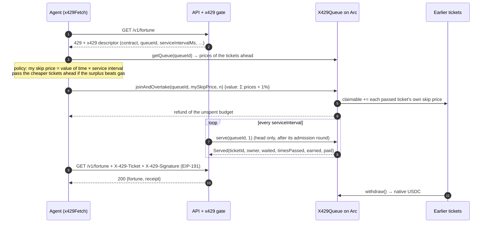

# x429: HTTP 429, settled

**Too Many Requests, settled fairly.** When an API is saturated, it answers `429` with an
x429 descriptor. Clients queue onchain on **Arc**, where USDC is the gas token. Anyone may
cut the line, but must pay **every ticket they pass, at that ticket's own posted skip price**,
in the same transaction. The service serves the queue from the head.

```
GET /v1/fortune                         →  429 {"x429": {"contract": "0x…", "queueId": 1, …}}
joinAndOvertake(1, skipPrice, n) + USDC →  passes n agents, pays each their own price
Served(ticket)                          →  GET /v1/fortune  X-429-Ticket / X-429-Signature  →  200
```

## Why

- **Retry storms.** A plain `429` tells every client to come back later. They all do, at once,
  with exponential backoff and jitter, and the service burns capacity rejecting them. Nobody
  knows their place, so nobody can plan.
- **Paid priority lanes pay the platform.** "Pro tiers" and priority fees let some users skip
  the line, but the money goes to the platform. The people who were pushed back get nothing.

x429 replaces both with an explicit, public queue. Waiting has a posted price, and whoever
cuts pays the people they cut, not the platform. If you are in no hurry, you get paid to wait.

## How it works



1. The API answers `429` with a descriptor: chain, contract, queue id, service interval.
2. The client joins with a **skip price**: what it wants to be paid each time someone passes it.
3. Anyone can move ahead with `overtake` / `joinAndOvertake`. The contract walks forward from
   the ticket just ahead, passing tickets while the running total fits the budget in `msg.value`.
   Each passed ticket is credited **its own** price, and the rest is refunded.
4. The operator serves the head, one ticket per service interval. The client signs
   `x429:v1:<chainId>:<contract>:<ticketId>` and retries; the server admits it exactly once.

The full protocol is in [SPEC.md](SPEC.md).

## Why Arc

Paying *every* ticket you pass is only practical when a transfer costs a tiny fraction of the
amounts involved, settles at once, and is priced in money people actually think in.

- **USDC is the gas token.** Skip prices, budgets, refunds and gas are all native USDC (18
  decimals). Nobody needs to hold a volatile token to wait in line, and a value of time in
  "USDC per second" maps directly onto `msg.value`.
- **Sub-cent fees.** At Arc's 20 gwei base fee, gas costs 2e-8 USDC per unit. Measured with
  the gas benchmarks in `contracts/test/X429Queue.t.sol`: each call runs as its own transaction
  (`forge test --gas-report`, forge 1.8.5), including the 21k base cost, before refunds. Passed
  owners start with zero `claimable`, which is the expensive case.

  | Call | Gas | × 20 gwei |
  |---|---:|---:|
  | `join` (24 tickets ahead) | 94,074 | 0.0019 USDC |
  | `joinAndOvertake`, passing 1 | 218,674 | 0.0044 USDC |
  | `joinAndOvertake`, passing 5 | 441,278 | 0.0088 USDC |
  | `joinAndOvertake`, passing 20 | 1,276,043 | 0.0255 USDC |
  | `overtake`, passing 5 | 393,418 | 0.0079 USDC |
  | `serve(queueId, 1)` | 57,115 | 0.0011 USDC |
  | `withdraw` | 43,345 | 0.0009 USDC |

  Each extra person passed costs about **55.7k gas ≈ 0.0011 USDC**, and that person is paid
  their full skip price (0.002 USDC by default in the dashboard). Paying everyone you pass, one
  by one, is viable at these fees; on a chain where a transfer costs dollars, it would not be.
  The demo's whole bot swarm (8 joins, a few overtakes, top-ups) spends about 0.03 USDC of gas
  per rush.
- **Deterministic, instant finality** (~0.5 s blocks). One inclusion is final, so the operator
  can admit a served ticket as soon as it sees the receipt, with no confirmation wait.

## Live deployment

<!-- LIVE_LINKS -->
- **Dashboard:** https://0xmago77.github.io/x429/ (watch the lane live, or join the queue with your own wallet)
- **Contract:** [`0xcADd3151AE5D51F81977668CEe47AA1B641e4990`](https://explorer.arc.io/address/0xcADd3151AE5D51F81977668CEe47AA1B641e4990) on Arc mainnet (chain 5042).
  Source verified on the [Arc explorer](https://explorer.arc.io/address/0xcADd3151AE5D51F81977668CEe47AA1B641e4990?tab=contract) and on [Sourcify](https://repo.sourcify.dev/5042/0xcADd3151AE5D51F81977668CEe47AA1B641e4990) (exact match).
- **Deploy transaction:** [`0xfc0958fb…784e683d`](https://explorer.arc.io/tx/0xfc0958fb8c13199175d2c098b6dcefafa59d9704af78a5615a27e865784e683d) (block 24,811,264; 2,082,862 gas ≈ 0.042 USDC)
- **Queue id:** 1, served by operator [`0x73ACFD91…d6fe05a2`](https://explorer.arc.io/address/0x73ACFD91725A5403afd37a5AB4000eD8d6fe05a2), one request per 15 s
- Record: [`deployments/arc-mainnet.json`](deployments/arc-mainnet.json)
<!-- /LIVE_LINKS -->

## Quickstart

The SDK (`sdk/`, package name `x429`) is TypeScript that runs directly on Node ≥ 23.6 (native
type stripping) and depends only on [viem](https://viem.sh).

### For API providers: the gate

```ts
import { createServer } from "node:http";
import { createPublicClient, createWalletClient } from "viem";
import { privateKeyToAccount } from "viem/accounts";
import { arc, makeTransport, ARC_RPC_URLS } from "./sdk/src/chain.ts";
import { createX429Gate } from "./sdk/src/server.ts";

const transport = makeTransport(ARC_RPC_URLS); // fallback over the public RPCs, with retries
const publicClient = createPublicClient({ chain: arc, transport, pollingInterval: 1500 });
const operator = createWalletClient({ account: privateKeyToAccount(operatorKey), chain: arc, transport });

const gate = createX429Gate({
  publicClient,
  operator,                    // serves the queue: serve(queueId, 1) per interval
  contract: "0x…",
  queueId: 1,
  serviceIntervalMs: 15_000,   // capacity: one request per 15 s
  admissionTtlMs: 60_000,      // a served ticket has 60 s to come back
});
gate.start();

createServer(async (req, res) => {
  if (await gate(req, res)) return;          // the gate answered: 429, 403 or GET /x429
  const admission = gate.admission(req);     // set when the request came through the queue
  res.end(JSON.stringify({ hello: "world", ticket: admission?.ticketId.toString() ?? null }));
}).listen(8429);
```

### For agents: `x429Fetch`

```ts
import { createPublicClient, createWalletClient } from "viem";
import { privateKeyToAccount } from "viem/accounts";
import { arc, makeTransport, ARC_RPC_URLS, usdc } from "./sdk/src/chain.ts";
import { x429Fetch } from "./sdk/src/client.ts";
import { QueueWatcher } from "./sdk/src/watcher.ts";

const transport = makeTransport(ARC_RPC_URLS);
const publicClient = createPublicClient({ chain: arc, transport, pollingInterval: 1500 });
const wallet = createWalletClient({ account: privateKeyToAccount(agentKey), chain: arc, transport });

const res = await x429Fetch("https://api.example.com/v1/fortune", undefined, {
  wallet,
  publicClient,
  valuePerSecond: usdc("0.001"),   // a second of my time is worth 0.001 USDC
  onOvertake: (e) => console.log(`passed ${e.passed} tickets for ${e.paid} wei`),
  onGas: (receipt) => budget.add(receipt.gasUsed * receipt.effectiveGasPrice),
  // watcher: new QueueWatcher({ client: publicClient, contract, queueId }).start(), // share one per process
});
console.log(res.status, await res.json());
```

A `429` without an x429 descriptor, and any other response, is returned untouched.

## Economics

Each client posts a skip price `p`: the amount it accepts in exchange for being pushed back one
position. Our policy sets `p = value of time × service interval`, the honest cost of losing one
slot.

A mover with honest price `m` passes ticket `j` only if `p_j < m`, and pays exactly `p_j`:

- **Ticket `j`** waits one more slot, which it values at `p_j`, and receives `p_j`: it is
  exactly compensated, so it is no worse off.
- **The mover** gains one slot, worth `m`, for `p_j < m`: a surplus of `m − p_j`. It overtakes
  only if the total surplus beats the gas.
- **Everyone else** keeps their position.

So with honest skip prices, every overtake is a **Pareto improvement**: nobody is worse off and
someone is better off. The queue sorts itself toward people who value time most, and the
transfer goes to the people who yield, not to the platform. Posting a price above your true
value only makes you less likely to be passed (and paid); posting below it means you get passed
for less than your time was worth. The platform's revenue is unchanged: it still serves one
request per interval.

In the demo, eight bots with values of time from 0.00001 to 0.003 USDC/s, plus lognormal noise,
rush the API every three hours. A human who joins from the dashboard wakes them immediately. The
human usually gets passed a few times and is paid for each pass.

## Arc engineering notes

- **18-decimal native USDC vs the 6-decimal ERC-20.** On Arc, `msg.value`, balances and gas
  are native USDC with **18** decimals. The ERC-20 USDC interface at `0x3600…0000` uses **6**
  decimals. x429 never touches the ERC-20: every amount is native wei, formatted with
  `formatUnits(x, 18)` and labelled "USDC".
- **The 20 gwei floor and silent drops.** A transaction with `maxFeePerGas` below the 20 gwei
  base-fee floor is not rejected; it is silently dropped and never mined. Every transaction x429
  sends uses `maxFeePerGas = 50 gwei` and `maxPriorityFeePerGas = 0.01 gwei` (`FEES` in
  `sdk/src/chain.ts`).
- **`PREVRANDAO` is always 0.** x429 needs no onchain randomness. Bot arrival order and noise are
  drawn offchain.
- **Shared timestamps.** `block.timestamp` is non-decreasing, and several ~0.5 s blocks share a
  second. `waited` can be 0, and nothing assumes strictly increasing time (tested with `vm.roll`
  without `vm.warp`).
- **Blocklist → pull payments.** A value transfer to or from a blocklisted address reverts, and
  so does sending value to `address(0)`. If overtakes pushed compensation, one blocklisted owner
  could block everyone behind them. Compensation is credited to `claimable` and pulled with
  `withdraw` / `withdrawFor`. Only the refund of unspent budget is pushed, and it falls back to
  a credit if the push fails.
- **`eth_getLogs` limits.** A range of ≥ 10,000 blocks fails with `-32012`, and some backends cap
  results at 2,000. The watcher and the dashboard query in chunks of ≤ 1,000 blocks and halve
  the chunk on any range error (`getLogsChunked` in `sdk/src/watcher.ts`).
- **Public RPC rate limits.** The public endpoints answer HTTP 429 above a few requests per
  second. x429 uses a viem `fallback` over the four public RPCs with retries and exponential
  backoff, one shared `QueueWatcher` per process polling every ≥ 1.5 s, and one transaction in
  flight per wallet (so nonces cannot race across providers).
- **Explorer.** `explorer.arc.io` sits behind a bot challenge, so it is used for links only.

## Local development and tests

Requirements: Node ≥ 23.6 (tested on v26), Foundry (`forge`, `cast`, `anvil`), and optionally
[Arc Foundry](https://docs.arc.io) (`arc-forge`, `arc-anvil`).

```bash
git clone --recurse-submodules https://github.com/0xmago77/x429 && cd x429
npm install

cd contracts && forge test && cd ..         # unit, fuzz and invariant tests
(cd contracts && arc-forge test --network arc) # the same suite under Arc runtime rules
(cd sdk && node --test)                     # SDK unit tests (policy, chain helpers, gate)
npx tsc --noEmit -p sdk && npx tsc --noEmit -p demo && npx tsc --noEmit -p web
node web/build.mjs                          # dashboard → site/
npm run e2e                                 # full local run on arc-anvil (see below)
npm run e2e:human                           # same, but the human's join wakes the idle bots
```

`scripts/e2e-local.sh` starts `arc-anvil --network arc` (falling back to `anvil`). It derives
keys from anvil's public test mnemonic into `.e2e/`, deploys with `script/Deploy.s.sol`, funds
the operator and the bots from a treasury (`demo/setup.ts fund`), and starts the demo API with
a 3 s service interval and a 30 s admission round. A "human" then joins at 0.001 USDC with
`cast`, and the bot swarm rushes. The script asserts ≥ 8 successful requests, at least one
overtake, at least one payment to the human, that the human is served, an empty queue at the
end, and contract balance == Σ claimable. It also checks that `setup.ts site-config` writes
only public data. A typical run takes about 100 s.

Run the demo yourself against any chain:

```bash
export X429_CHAIN=anvil X429_RPC_URLS=http://127.0.0.1:8545 X429_CONTRACT=0x… X429_QUEUE_ID=1
export X429_OPERATOR_KEY_FILE=… X429_TREASURY_KEY_FILE=… X429_BOT_KEYS_DIR=… X429_ADDRESSES_FILE=…
node demo/setup.ts fund --operator 0.5 --bot 0.25 --dry-run
node demo/server.ts      # the API on 127.0.0.1:8429
X429_RUSH_NOW=1 node demo/agents.ts
node demo/setup.ts site-config && node web/build.mjs && python3 -m http.server -d site 8080
```

Keys are only ever read from files whose paths come from the environment. See `ops/env.example`
and the systemd units in `ops/`.

### Repository layout

| Path | What |
|---|---|
| `contracts/` | `X429Queue.sol`, Foundry tests (unit, fuzz, invariant), `script/Deploy.s.sol` |
| `sdk/` | `x429`: `chain.ts` (Arc chain, fees, helpers), `abi.ts`, `watcher.ts`, `policy.ts`, `client.ts` (`x429Fetch`), `server.ts` (`createX429Gate`) |
| `demo/` | fortune API (`server.ts`), bot swarm (`agents.ts`), `setup.ts`, `config.ts`, `bots.ts` |
| `web/` → `site/` | the dashboard (vanilla TS + CSS, bundled with esbuild) |
| `scripts/` | `e2e-local.sh`, `e2e-check.ts`, `export-abi.mjs` |
| `ops/` | systemd `--user` unit templates |
| `deployments/` | deployment records |

## Limitations and next steps

- **Spam bonds.** Joining costs only gas. A refundable bond, slashed by `kick` and returned on
  serve, would make queue-stuffing costly without hurting honest clients.
- **x402 / nanopayment integration.** x429 settles *waiting*. x402 settles *paying for the
  request itself*. A combined flow ("pay per call, and pay to cut when saturated") is natural,
  and nanopayment channels could batch tiny compensations.
- **Gas sponsorship via a paymaster.** The operator could sponsor joins for first-time users,
  so a human needs no gas to wait in line.
- **Multi-slot capacity.** The gate models one service slot per interval. Real APIs have N
  concurrent slots and variable service times; `serve(queueId, k)` already supports batch
  serving.
- Admissions live in the server's memory, so a restart drops pending ones (those tickets get
  403 `not_admitted`). Persisting them is straightforward.
- The policy is greedy and myopic. It does not anticipate later arrivals or re-bid while
  waiting.
- The contract is unaudited. This is a proof of concept for Arc Microgrants.

## License

[MIT](LICENSE). Copyright (c) 2026 x429 contributors.
